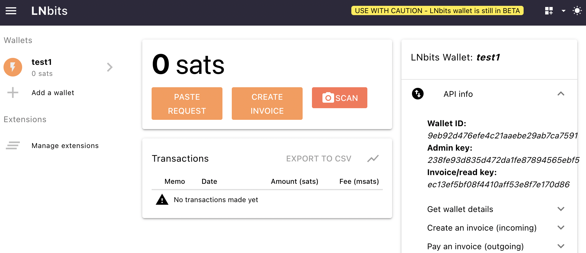
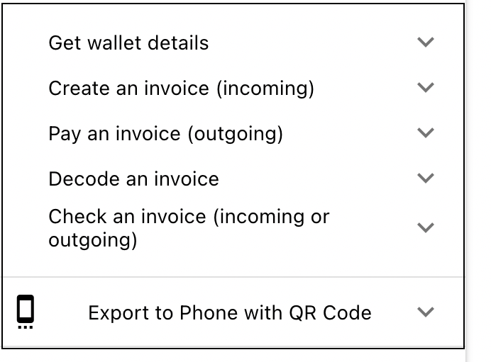

# How To Guides

This is a brief guide on how to use the pylnbits library. First create an an account on your LNBits instance by visiting the main page and naming your wallet. Be sure to bookmark the link to be able to get access in the future. If you are not familiar with LNBits, please take the time to familiarize yourself with how user accounts work and how invoices are created and paid on LNBits first. 

Next, click on `enable extensions` in the side navigation bar on your LNBits account. Enable the extensions that you want to use. Extension use is *optional*, and is not required for generating invoices or receiving payments. The **pylnbits** library currently only supports the following extensions from [LNBits](https://lnbits.com): 

- User Wallet 
- User Manager
- LNURLp
- LNURLw
- LndHub

## Getting Started

Use version at least **python3.8**

### Install from source
```
git clone https://github.com/lightningames/pylnbits
cd pylnbits
python3 -m venv venv
source venv/bin/activate
pip install -r requirements.txt
pip install -e .
```

### Release Note
current pylnbits release is 0.0.3
It is only effective up to LNBITS commit 
[https://github.com/lnbits/lnbits-legend/commit/e46e881663eb4d70b691e09ac1c97eecd6b547b8
](https://github.com/lnbits/lnbits-legend/commit/e46e881663eb4d70b691e09ac1c97eecd6b547b8
)

### PyPi release
[https://pypi.org/project/pylnbits/](https://pypi.org/project/pylnbits/)

```
pip install pylnbits
```

## Set up your Config

In your LNBits account, click on the API info tab. You should see **Wallet ID, Admin Key and Invoice/read key**. 



First create a `config.yml` file, copy the Keys from LNBits with your values. There is a sample `config_sample.yml` file in the pylnbits source directory.


### `config.yml`
```
lnbits_url: "https://<your lnbits domain here>"

# api_key from LNbits User Manager Extension
in_key: "<your Invoice Key here>" 
admin_key: "< Your Admin Key here>"
```

## Example Code

### Sample code for user wallet 

The following is sample code that uses config.yml in your current directory for calling methods from the LNURLp extension. 

This Example code runs test for the following: 

- INITIALIZE the pylnbits with your config file
- GET wallet details
- CHECK an invoice payment hash
- CREATE an invoice
- PAY an invoice (Bolt11)

Replace the sample data with your data, e.g. bolt and payment_hash variables

```
import asyncio

from aiohttp.client import ClientSession

from pylnbits.config import Config
from pylnbits.user_wallet import UserWallet

async def main():

    # INITIALIZE the pylnbits with your config file
    c = Config(config_file="config.yml")
    url = c.lnbits_url
    print(f"url: {url}")
    print(f"headers: {c.headers()}")
    print(f"admin_headers: {c.admin_headers()}")


    async with ClientSession() as session:
        # GET wallet details
        uw = UserWallet(c, session)
        userwallet = await uw.get_wallet_details()
        print(f"user wallet info : {userwallet}")

        # CHECK an invoice payment hash
        payment_hash = "edefef3766537446c70e51af9b414fb3b319baf515f1ff9852c0289eae3665a1"
        res = await uw.check_invoice(payment_hash)
        print(f"check invoice response: {res}")
 
        # CREATE an invoice
        res = await uw.create_invoice(False, 150, "testcreatetwo", "http://google.com")
        print(f'\nCreate invoice RESPONSE: {res}\n\n')

        # PAY an invoice - add balance and check
        # replace the bolt below with your bolt11
        bolt = "lnbc800n1ps23r2dpp5ahh77dmx2d6yd3cw2xheks20kwe3nwh4zhcllxzjcq5fat3kvkssdqsd9h8vmmfvdjk7mn9cqzpgrzjq02snzwz4petaly54yzjkm358rqa5as9hkgydjvxxmvlpuk6dfd9cz0y2cqq0qsqqyqqqqlgqqqqqqgq9qsp5cut63ftfcffwkrr2w9r50w5e40m93k3er75mc70ysxps7yercs9s9qyyssqs7qk3cz97nm5m6ehzedcxhttx87l7x5kk38gvwkzzv4lhrhddtqq3sk43nnvsddagf36ledw9vhlpqxuu5s53pj6sz926mwqxf8chsgp2m9j8w"  # noqa
        body = {"out": True, "bolt11": bolt}
        res = await uw.pay_invoice(True, bolt)
        print(res)


loop = asyncio.get_event_loop()
loop.run_until_complete(main())

```

For more details on what values need to be passed in for the methods, check the LNBits API docs, which should be located on the LNBits site below your LNBits Admin and Invoice Key.


### Expand the tabs for more LNBits API info



### Sample code for LNURLp

The following is sample code that uses config.yml in your current directory for calling methods from the LNURLp extension

```
# test lnurlp pay link
import asyncio

from aiohttp.client import ClientSession

from pylnbits.config import Config
from pylnbits.lnurl_p import LnurlPay

# Example code for testing LNURLp

async def main():
    c = Config(config_file="config.yml")
    url = c.lnbits_url
    print(f"url: {url}")
    print(f"headers: {c.headers()}")
    print(f"admin_headers: {c.admin_headers()}")

    async with ClientSession() as session:
        lw = LnurlPay(c, session)

        # list links        
        links = await lw.list_paylinks()
        print("list all links: " , str(links), "\n\n")

        # get pay link 
        pay_id = links[0]['id']
        print(f'pay_id for get_link: {pay_id}')
        getlink = await lw.get_paylink(pay_id=str(pay_id))
        print("get pay link: ", str(getlink), "\n")

        # create pay link
        body = {"description": "auto pay link",
                "amount": 100,
                "max": 10000,
                "min": 100,
                "comment_chars": 100}

        newlink = await lw.create_paylink(body=body)
        print(f"create pay link with body: {body}, result link: {newlink} \n")
        pay_id = newlink['id']

        # update newly created link above
        # all body fields are required
        body = {"description": "update auto paylink",
                "amount": 150, 
                "max": 10000,
                "min": 100,
                "comment_chars": 100}
        update_result = await lw.update_paylink(pay_id=str(pay_id), body=body)
        print(f'update pay link with intial id: {pay_id}, body: {body} \n result: {update_result}\n\n')

        # delete above created link
        delete_result = await lw.delete_paylink(pay_id=str(pay_id))
        print(f'delete pay link id: {pay_id}, result: {delete_result}\n\n')


loop = asyncio.get_event_loop()
loop.run_until_complete(main())

```

## More Examples

More example code can be found in the **tests** directory as shown in the [Project Layout](/#project-layout) section. 
